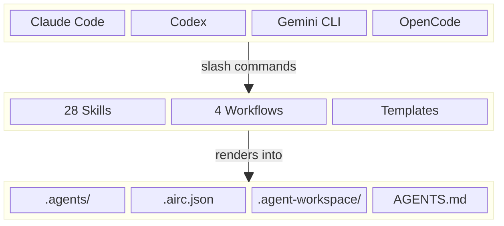

# Agent Infra

[](https://www.npmjs.com/package/@fitlab-ai/agent-infra)
[](https://www.npmjs.com/package/@fitlab-ai/agent-infra)
[](License.txt)
[](https://nodejs.org/)
[](https://github.com/fitlab-ai/agent-infra/releases)
[](CONTRIBUTING.md)

The missing collaboration layer for AI coding agents — unified skills and workflows for Claude Code, Codex, Gemini CLI, and OpenCode.

**Semi-automated programming, powered by AI agents.** Define a requirement, let AI handle analysis, planning, coding, review, and delivery — you only step in when it matters.

[中文版](README.zh-CN.md)

<a id="why-agent-infra"></a>

## Why agent-infra?

Teams increasingly mix Claude Code, Codex, Gemini CLI, OpenCode, and other AI TUIs in the same repository, but each tool tends to introduce its own commands, prompts, and local conventions. Without a shared layer, the result is fragmented workflows, duplicated setup, and task history that is difficult to audit.

agent-infra standardizes that collaboration surface. It gives every supported AI TUI the same task lifecycle, the same skill vocabulary, the same project governance files, and the same upgrade path, so teams can switch tools without rebuilding process from scratch.

<a id="see-it-in-action"></a>

## See it in Action

**Scenario**: Issue #42 reports *"Login API returns 500 when email contains a plus sign"*. Here is the full fix lifecycle — AI does the heavy lifting, you stay in control:

```bash
/import-issue 42
```

> AI reads the issue, creates `TASK-20260319-100000`, and extracts requirements.

```bash
/analyze-task TASK-20260319-100000
```

> AI scans the codebase, identifies `src/auth/login.ts` as the root cause, and writes `analysis.md`.

```bash
/plan-task TASK-20260319-100000
```

> AI proposes a fix plan: *"Sanitize the email input in `LoginService.validate()` and add a dedicated unit test."*
>
> **You review the plan and reply in natural language:**

```
The plan looks right, but don't change the DB schema.
Just fix it at the application layer in LoginService.
```

> AI updates the plan accordingly and confirms.

```bash
/implement-task TASK-20260319-100000
```

> AI writes the fix, adds a test case for `user+tag@example.com`, and runs all tests — green.

```bash
/review-task TASK-20260319-100000
```

> AI reviews its own implementation: *"Approved. 0 blockers, 0 major, 1 minor (missing JSDoc)."*

```bash
/refine-task TASK-20260319-100000
```

> AI fixes the minor issue and re-validates.

```bash
/commit
/create-pr
/complete-task TASK-20260319-100000
```

> Commit created, PR #43 opened (auto-linked to issue #42), task archived.

**9 commands. 1 natural-language correction. From issue to merged PR.** That is the entire SOP — programming can have a standard operating procedure too.

Every command above works the same way in Claude Code, Codex, Gemini CLI, and OpenCode. Switch tools mid-task — the workflow state follows.

### What each skill does behind the scenes

These are not thin command aliases. Each skill encapsulates standardized processes that are tedious and error-prone when done by hand:

- **Structured artifacts** — every step produces a templated document (`analysis.md`, `plan.md`, `review.md`) with consistent structure, not free-form notes
- **Multi-round versioning** — requirements changed? Run `analyze-task` again to get `analysis-r2.md`; the full revision history is preserved
- **Severity-classified reviews** — `review-task` categorizes findings into Blocker / Major / Minor with file paths and fix suggestions, not a vague "looks good"
- **Cross-tool state continuity** — `task.md` records who did what and when; Claude can analyze, Codex can implement, Gemini can review — context transfers seamlessly
- **Audit trail and co-authorship** — every step appends to the Activity Log; the final commit includes `Co-Authored-By` lines for all participating AI agents

<a id="key-features"></a>

## Key Features

- **Multi-AI collaboration**: one shared operating model for Claude Code, Codex, Gemini CLI, and OpenCode
- **Bootstrap CLI + skill-driven execution**: initialize once, then let AI skills drive day-to-day work
- **Bilingual project docs**: English-first docs with synchronized Chinese translations
- **Template-source architecture**: `templates/` mirrors the rendered project structure
- **AI-assisted updates**: template changes can be merged while preserving project-specific customization

<a id="quick-start"></a>

## Quick Start

### 1. Install agent-infra

**Option A - npm (recommended)**

```bash
npm install -g @fitlab-ai/agent-infra
npx @fitlab-ai/agent-infra init
```

**Option B - Shell script**

```bash
curl -fsSL https://raw.githubusercontent.com/fitlab-ai/agent-infra/main/install.sh | sh
```

**Option C - Install from source**

```bash
git clone https://github.com/fitlab-ai/agent-infra.git
cd agent-infra
sh install.sh
```

### Updating agent-infra

Already installed? Update to the latest version using the same method you used to install:

**Option A - npm**

```bash
npm update -g @fitlab-ai/agent-infra
```

**Option B - Shell script**

```bash
curl -fsSL https://raw.githubusercontent.com/fitlab-ai/agent-infra/main/install.sh | sh
```

**Option C - Install from source**

```bash
cd agent-infra
git pull
sh install.sh
```

Check your current version:

```bash
ai version
# or: agent-infra version
```

### 2. Initialize a new project

```bash
cd my-project
ai init
# or: agent-infra init
```

The CLI collects project metadata, installs the `update-agent-infra` seed command for all supported AI TUIs, and generates `.airc.json`.

> `ai` is a shorthand for `agent-infra`. Both commands are equivalent.

### 3. Render the full infrastructure

Open the project in any AI TUI and run `update-agent-infra`:

| TUI | Command |
|-----|---------|
| Claude Code | `/update-agent-infra` |
| Codex | `$update-agent-infra` |
| Gemini CLI | `/{{project}}:update-agent-infra` |
| OpenCode | `/update-agent-infra` |

This pulls the latest templates and renders all managed files. The same command is used both for first-time setup and for future template upgrades.

<a id="architecture-overview"></a>

## Architecture Overview

agent-infra is intentionally simple: a bootstrap CLI creates the seed configuration, then AI skills and workflows take over.

### End-to-End Flow

1. **Install** — `npm install -g @fitlab-ai/agent-infra` (or use the shell script)
2. **Initialize** — `ai init` in the project root to generate `.airc.json` and install the seed command
3. **Render** — run `update-agent-infra` in any AI TUI to pull templates and generate all managed files
4. **Develop** — use 28 built-in skills to drive the full lifecycle: `analysis → design → implementation → review → fix → commit`
5. **Update** — run `update-agent-infra` again whenever a new template version is available

### Layered Architecture



GitHub renders Mermaid diagrams natively. If a downstream renderer does not, the text above still explains the system structure.

<a id="what-you-get"></a>

## What You Get

After setup, your project gains a complete AI collaboration infrastructure:

```text
my-project/
├── .agents/               # Shared AI collaboration config
│   ├── skills/            # 28 built-in AI skills
│   ├── workflows/         # 4 prebuilt workflows
│   └── templates/         # Task and artifact templates
├── .agent-workspace/      # Task workspace (git-ignored)
├── .claude/               # Claude Code config and commands
├── .gemini/               # Gemini CLI config and commands
├── .opencode/             # OpenCode config and commands
├── .github/               # PR templates, issue forms, workflows
├── AGENTS.md              # Universal AI agent instructions
├── CONTRIBUTING.md        # Contribution guide
├── SECURITY.md            # Security policy (English)
├── SECURITY.zh-CN.md      # Security policy (Chinese)
└── .airc.json             # Central configuration
```

<a id="built-in-ai-skills"></a>

## Built-in AI Skills

agent-infra ships with **28 built-in AI skills**. They are organized by use case, but they all share the same design goal: every AI TUI should be able to execute the same workflow vocabulary in the same repository.

<a id="task-lifecycle"></a>

### Task Lifecycle

| Skill | Description | Parameters | Recommended use case |
|-------|-------------|------------|----------------------|
| `create-task` | Create a task scaffold from a natural-language request. | `description` | Start a new feature, bug-fix, or improvement from scratch. |
| `import-issue` | Import a GitHub Issue into the local task workspace. | `issue-number` | Convert an existing Issue into an actionable task folder. |
| `analyze-task` | Produce a requirement analysis artifact for an existing task. | `task-id` | Capture scope, risks, and impacted files before designing. |
| `plan-task` | Write the technical implementation plan with a review checkpoint. | `task-id` | Define the approach after analysis is complete. |
| `implement-task` | Implement the approved plan and produce an implementation report. | `task-id` | Write code, tests, and docs after plan approval. |
| `review-task` | Review the implementation and classify findings by severity. | `task-id` | Run a structured code review before merging. |
| `refine-task` | Fix review findings in priority order without expanding scope. | `task-id` | Address review feedback and re-validate the task. |
| `complete-task` | Mark the task complete and archive it after all gates pass. | `task-id` | Close out a task after review, tests, and commit are done. |

<a id="task-status"></a>

### Task Status

| Skill | Description | Parameters | Recommended use case |
|-------|-------------|------------|----------------------|
| `check-task` | Inspect the current task status, workflow progress, and next step. | `task-id` | Check progress without modifying task state. |
| `block-task` | Move a task to blocked state and record the blocker reason. | `task-id`, `reason` (optional) | Pause work when an external dependency or decision is missing. |

<a id="issue-and-pr"></a>

### Issue and PR

| Skill | Description | Parameters | Recommended use case |
|-------|-------------|------------|----------------------|
| `create-issue` | Create a GitHub Issue from a task file. | `task-id` | Push a local task into GitHub tracking. |
| `sync-issue` | Post task progress updates back to the linked GitHub Issue. | `task-id` or `issue-number` | Keep stakeholders updated as the task evolves. |
| `create-pr` | Open a Pull Request to an inferred or explicit target branch. | `target-branch` (optional) | Publish reviewed changes for merge. |
| `sync-pr` | Sync task progress and review metadata into the Pull Request. | `task-id` | Keep PR metadata aligned with the local task record. |

<a id="code-quality"></a>

### Code Quality

| Skill | Description | Parameters | Recommended use case |
|-------|-------------|------------|----------------------|
| `commit` | Create a Git commit with task updates and copyright-year checks. | None | Finalize a coherent change set after tests pass. |
| `test` | Run the standard project validation flow. | None | Validate compile checks and unit tests after a change. |
| `test-integration` | Run integration or end-to-end validation. | None | Verify cross-module or workflow-level behavior. |

<a id="release-skills"></a>

### Release

| Skill | Description | Parameters | Recommended use case |
|-------|-------------|------------|----------------------|
| `release` | Execute the version release workflow. | `version` (`X.Y.Z`) | Publish a new project release. |
| `create-release-note` | Generate release notes from PRs and commits. | `version`, `previous-version` (optional) | Prepare a changelog before shipping. |

<a id="security-skills"></a>

### Security

| Skill | Description | Parameters | Recommended use case |
|-------|-------------|------------|----------------------|
| `import-dependabot` | Import a Dependabot alert and create a remediation task. | `alert-number` | Convert a dependency security alert into a tracked fix. |
| `close-dependabot` | Close a Dependabot alert with a documented rationale. | `alert-number` | Record why an alert does not require action. |
| `import-codescan` | Import a Code Scanning alert and create a remediation task. | `alert-number` | Triage CodeQL findings through the normal task workflow. |
| `close-codescan` | Close a Code Scanning alert with a documented rationale. | `alert-number` | Record why a scanning alert can be safely dismissed. |

<a id="project-maintenance"></a>

### Project Maintenance

| Skill | Description | Parameters | Recommended use case |
|-------|-------------|------------|----------------------|
| `upgrade-dependency` | Upgrade a dependency from one version to another and verify it. | `package`, `old-version`, `new-version` | Perform controlled dependency maintenance. |
| `refine-title` | Rewrite an Issue or PR title into Conventional Commits format. | `number` | Normalize inconsistent GitHub titles. |
| `init-labels` | Initialize the repository's standard GitHub label set. | None | Bootstrap labels in a new repository. |
| `init-milestones` | Initialize the repository's milestone structure. | None | Bootstrap milestone tracking in a new repository. |
| `update-agent-infra` | Update the project's collaboration infrastructure to the latest template version. | None | Refresh shared AI tooling without rebuilding local conventions. |

> Every skill works across supported AI TUIs. The command prefix changes, but the workflow semantics stay the same.

<a id="prebuilt-workflows"></a>

## Prebuilt Workflows

agent-infra includes **4 prebuilt workflows**. Three of them share the same gated delivery lifecycle:

`analysis -> design -> implementation -> review -> fix -> commit`

The fourth, `code-review`, is intentionally smaller and optimized for reviewing an existing PR or branch.

| Workflow | Best for | Step chain |
|----------|----------|------------|
| `feature-development` | Building a new feature or capability | `analysis -> design -> implementation -> review -> fix -> commit` |
| `bug-fix` | Diagnosing and fixing a defect with regression coverage | `analysis -> design -> implementation -> review -> fix -> commit` |
| `refactoring` | Structural changes that should preserve behavior | `analysis -> design -> implementation -> review -> fix -> commit` |
| `code-review` | Reviewing an existing PR or branch | `analysis -> review -> report` |

### Example lifecycle

The simplest end-to-end delivery loop looks like this:

```text
import-issue #42                    Import task from GitHub Issue
(or: create-task "add dark mode")   Or create a task from a description
         |
         |  --> get task ID, e.g. T1
         v
  analyze-task T1                   Requirement analysis
         |
         v
    plan-task T1                    Design solution  <-- human review
         |
         v
  implement-task T1                 Write code and tests
         |
         v
  +-> review-task T1                Automated code review
  |      |
  |   Issues?
  |      +--NO-------+
  |     YES          |
  |      |           |
  |      v           |
  |  refine-task T1  |
  |      |           |
  +------+           |
                     |
         +-----------+
         |
         v
      commit                        Commit final code
         |
         v
  complete-task T1                  Archive and finish
```

<a id="configuration-reference"></a>

## Configuration Reference

The generated `.airc.json` file is the central contract between the bootstrap CLI, templates, and future updates.

### Example `.airc.json`

```json
{
  "project": "my-project",
  "org": "my-org",
  "language": "en",
  "templateSource": "templates/",
  "templateVersion": "v0.3.1",
  "modules": ["ai", "github"],
  "files": {
    "managed": [
      ".agents/skills/",
      ".agents/templates/",
      ".agents/workflows/",
      ".claude/commands/",
      ".gemini/commands/",
      ".opencode/commands/"
    ],
    "merged": [
      ".agents/README.md",
      ".gitignore",
      "AGENTS.md",
      "CONTRIBUTING.md",
      "SECURITY.md"
    ],
    "ejected": []
  }
}
```

### Field reference

| Field | Meaning |
|-------|---------|
| `project` | Project name used when rendering commands, paths, and templates. |
| `org` | GitHub organization or owner used by generated metadata and links. |
| `language` | Primary project language or locale used by rendered templates. |
| `templateSource` | Local template root used during rendering. |
| `templateVersion` | Installed template version for future upgrades and drift tracking. |
| `modules` | Enabled template bundles. Supported values are `ai` and `github`. |
| `files` | Per-path update strategy configuration for managed, merged, and ejected files. |

### Module reference

| Module | Includes |
|--------|----------|
| `ai` | `.agents/`, `.claude/`, `.gemini/`, `.opencode/`, `AGENTS.md`, and related collaboration assets |
| `github` | `.github/`, contribution templates, release config, and GitHub governance assets |

<a id="file-management-strategies"></a>

## File Management Strategies

Each generated path is assigned an update strategy. That strategy determines how `update-agent-infra` treats the file later.

| Strategy | Meaning | Update behavior |
|----------|---------|-----------------|
| **managed** | agent-infra fully controls the file | Re-rendered and overwritten on update |
| **merged** | Template content and user customizations coexist | AI-assisted merge preserves local additions where possible |
| **ejected** | Generated once and then owned by the project | Never touched again by future updates |

### Example strategy configuration

```json
{
  "files": {
    "managed": [
      ".agents/skills/",
      ".github/workflows/pr-title-check.yml"
    ],
    "merged": [
      ".gitignore",
      "AGENTS.md",
      "CONTRIBUTING.md"
    ],
    "ejected": [
      "SECURITY.md"
    ]
  }
}
```

### Moving a file from `managed` to `ejected`

1. Remove the path from the `managed` array in `.airc.json`.
2. Add the same path to the `ejected` array.
3. Run `update-agent-infra` again so future updates stop managing that file.

Use this when a file starts as template-owned but later becomes project-specific enough that automatic updates would create more noise than value.

<a id="version-management"></a>

## Version Management

agent-infra uses semantic versioning through Git tags and GitHub releases. The installed template version is recorded in `.airc.json` as `templateVersion`, which gives both humans and AI tools a stable reference point for upgrades.

<a id="contributing"></a>

## Contributing

See [CONTRIBUTING.md](CONTRIBUTING.md) for development guidelines.

<a id="license"></a>

## License

[MIT](License.txt)
