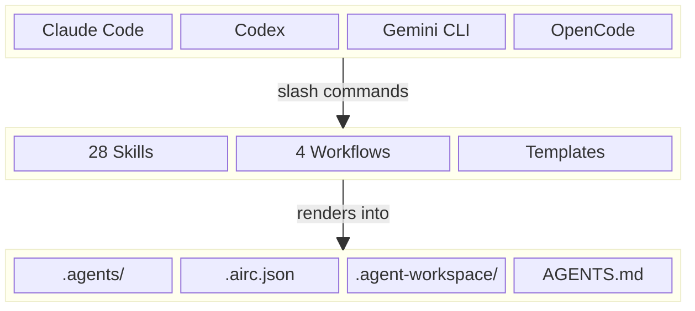

# Agent Infra

[](https://www.npmjs.com/package/@fitlab-ai/agent-infra)
[](https://www.npmjs.com/package/@fitlab-ai/agent-infra)
[](License.txt)
[](https://nodejs.org/)
[](https://github.com/fitlab-ai/agent-infra/releases)
[](CONTRIBUTING.md)

AI 编程代理之间缺失的协作层 —— 为 Claude Code、Codex、Gemini CLI、OpenCode 提供统一的 skills 和工作流。

**AI Agent 半自动化编程神器。** 定义需求，让 AI 完成分析、方案设计、编码、审查和交付 —— 你只需在关键节点介入。

[English](README.md)

<a id="why-agent-infra"></a>

## 为什么需要 agent-infra？

越来越多的团队会在同一个仓库里混用 Claude Code、Codex、Gemini CLI、OpenCode 等 AI TUI，但每个工具往往都会带来自己的命令体系、提示词习惯和本地约定。缺少共享层时，结果通常是工作流割裂、初始化重复、任务历史难以追踪。

agent-infra 的目标就是把这层协作面标准化。它为所有支持的 AI TUI 提供统一的任务生命周期、统一的 skill 词汇、统一的项目治理文件以及统一的升级路径，让团队切换工具时不必重新发明流程。

<a id="see-it-in-action"></a>

## 实战演示

**场景**：Issue #42 报告 *"登录接口在邮箱包含加号时返回 500"*。以下是完整的修复流程 —— AI 执行主要工作，你掌控方向：

```bash
/import-issue 42
```

> AI 读取 Issue，创建 `TASK-20260319-100000`，提取需求。

```bash
/analyze-task TASK-20260319-100000
```

> AI 扫描代码库，定位 `src/auth/login.ts` 为根因，输出 `analysis.md`。

```bash
/plan-task TASK-20260319-100000
```

> AI 提出修复方案：*"在 `LoginService.validate()` 中清洗邮箱输入，并添加专项单元测试。"*
>
> **你审查方案后用自然语言回复：**

```
方案方向没问题，但不要动数据库结构。
只在应用层的 LoginService 里修复就行。
```

> AI 按你的要求更新方案并确认。

```bash
/implement-task TASK-20260319-100000
```

> AI 编写修复代码，添加 `user+tag@example.com` 的测试用例，运行全部测试 —— 通过。

```bash
/review-task TASK-20260319-100000
```

> AI 审查自己的实现：*"通过。0 阻塞项，0 主要问题，1 次要问题（缺少 JSDoc）。"*

```bash
/refine-task TASK-20260319-100000
```

> AI 修复次要问题并重新验证。

```bash
/commit
/create-pr
/complete-task TASK-20260319-100000
```

> 提交完成，PR #43 已创建（自动关联 Issue #42），任务归档。

**9 条命令，1 次自然语言纠正，从 Issue 到合并 PR。** 这就是完整的 SOP —— 编程也可以有标准作业流程。

以上每条命令在 Claude Code、Codex、Gemini CLI、OpenCode 中完全通用。任务进行到一半切换工具，工作流状态照常延续。

### 每个 skill 背后做了什么

这些不是简单的命令别名。每个 skill 都封装了手动操作时容易遗漏或不一致的标准化流程：

- **结构化产物** — 每个步骤都输出模板化的文档（`analysis.md`、`plan.md`、`review.md`），格式统一，而非自由发挥的散文
- **多轮版本化** — 需求变了？再执行一次 `analyze-task` 会生成 `analysis-r2.md`，完整修订历史自动保留
- **分级审查机制** — `review-task` 按 Blocker / Major / Minor 分类问题，附带文件路径和修复建议，而非含糊的"看着没问题"
- **跨工具状态延续** — `task.md` 记录了谁在什么时间做了什么；Claude 分析、Codex 实现、Gemini 审查——上下文无缝衔接
- **审计轨迹与联合署名** — 每个步骤自动追加 Activity Log；最终提交包含所有参与 AI 的 `Co-Authored-By` 署名

<a id="key-features"></a>

## 核心特性

- **多 AI 协作**：为 Claude Code、Codex、Gemini CLI、OpenCode 提供统一的协作模型
- **引导 CLI + skill 驱动执行**：初始化一次，后续日常操作交给 AI skills
- **双语文档**：英文为主文档，配套同步的中文版本
- **模板源架构**：`templates/` 目录镜像最终渲染出的项目结构
- **AI 辅助升级**：模板升级时可合并变更，同时尽量保留项目侧定制

<a id="quick-start"></a>

## 快速开始

### 1. 安装 agent-infra

**方式 A - npm（推荐）**

```bash
npm install -g @fitlab-ai/agent-infra
npx @fitlab-ai/agent-infra init
```

**方式 B - Shell 脚本**

```bash
curl -fsSL https://raw.githubusercontent.com/fitlab-ai/agent-infra/main/install.sh | sh
```

**方式 C - 从源码安装**

```bash
git clone https://github.com/fitlab-ai/agent-infra.git
cd agent-infra
sh install.sh
```

### 更新 agent-infra

如果已经安装过，可以按你最初安装时使用的方式升级到最新版本：

**方式 A - npm**

```bash
npm update -g @fitlab-ai/agent-infra
```

**方式 B - Shell 脚本**

```bash
curl -fsSL https://raw.githubusercontent.com/fitlab-ai/agent-infra/main/install.sh | sh
```

**方式 C - 从源码安装**

```bash
cd agent-infra
git pull
sh install.sh
```

查看当前版本：

```bash
ai version
# 或：agent-infra version
```

### 2. 初始化新项目

```bash
cd my-project
ai init
# 或：agent-infra init
```

CLI 会收集项目元数据，向所有支持的 AI TUI 安装 `update-agent-infra` 种子命令，并生成 `.airc.json`。

> `ai` 是 `agent-infra` 的简写命令，两者等价。

### 3. 渲染完整基础设施

在任意 AI TUI 中执行 `update-agent-infra`：

| TUI | 命令 |
|-----|------|
| Claude Code | `/update-agent-infra` |
| Codex | `$update-agent-infra` |
| Gemini CLI | `/{{project}}:update-agent-infra` |
| OpenCode | `/update-agent-infra` |

该命令会拉取最新模板并渲染所有受管理文件。首次安装和后续升级都使用同一条命令。

<a id="architecture-overview"></a>

## 架构概览

agent-infra 的结构刻意保持简单：引导 CLI 负责生成种子配置，之后由 AI skills 和 workflows 接管后续协作。

### 端到端流程

1. **安装** — `npm install -g @fitlab-ai/agent-infra`（或使用 shell 脚本）
2. **初始化** — 在项目根目录运行 `ai init`，生成 `.airc.json` 并安装种子命令
3. **渲染** — 在任意 AI TUI 中执行 `update-agent-infra`，拉取模板并生成所有受管理文件
4. **开发** — 使用 28 个内置 skill 驱动完整生命周期：`analysis → design → implementation → review → fix → commit`
5. **升级** — 有新模板版本时再次执行 `update-agent-infra` 即可

### 分层架构



GitHub 原生支持 Mermaid 渲染。即使某些下游渲染器不支持，上方文字也足以传达系统结构。

<a id="what-you-get"></a>

## 安装效果

安装完成后，项目将获得完整的 AI 协作基础设施：

```text
my-project/
├── .agents/               # 共享 AI 协作配置
│   ├── skills/            # 28 个内置 AI skills
│   ├── workflows/         # 4 个预置工作流
│   └── templates/         # 任务与产物模板
├── .agent-workspace/      # 任务工作区（git 忽略）
├── .claude/               # Claude Code 配置与命令
├── .gemini/               # Gemini CLI 配置与命令
├── .opencode/             # OpenCode 配置与命令
├── .github/               # PR 模板、Issue 表单、工作流
├── AGENTS.md              # 通用 AI agent 指令
├── CONTRIBUTING.md        # 贡献指南
├── SECURITY.md            # 安全策略（英文）
├── SECURITY.zh-CN.md      # 安全策略（中文）
└── .airc.json             # 中央配置文件
```

<a id="built-in-ai-skills"></a>

## 内置 AI Skills

agent-infra 内置 **28 个 AI skills**。它们按使用场景分组，但共享同一个核心目标：无论使用哪种 AI TUI，都能在同一仓库里执行相同的工作流词汇和协作约定。

<a id="task-lifecycle"></a>

### 任务生命周期

| Skill | 描述 | 参数 | 推荐场景 |
|-------|------|------|---------|
| `create-task` | 根据自然语言请求创建任务骨架。 | `description` | 从零开始记录新功能、缺陷或改进需求。 |
| `import-issue` | 将 GitHub Issue 导入本地任务工作区。 | `issue-number` | 把已有 Issue 转成可执行的任务目录。 |
| `analyze-task` | 为已有任务输出需求分析产物。 | `task-id` | 在设计前明确范围、风险和受影响文件。 |
| `plan-task` | 编写技术实施方案，并设置人工审查检查点。 | `task-id` | 分析完成后定义具体实现路径。 |
| `implement-task` | 按批准方案实施并生成实现报告。 | `task-id` | 在方案获批后编写代码、测试和文档。 |
| `review-task` | 审查实现结果，并按严重程度分类问题。 | `task-id` | 合入前执行结构化代码审查。 |
| `refine-task` | 按优先级修复审查问题，不额外扩张范围。 | `task-id` | 根据 review 反馈完成修正。 |
| `complete-task` | 在所有关卡通过后标记任务完成并归档。 | `task-id` | 测试、审查和提交都完成后收尾。 |

<a id="task-status"></a>

### 任务状态

| Skill | 描述 | 参数 | 推荐场景 |
|-------|------|------|---------|
| `check-task` | 查看当前任务状态、工作流进度和下一步建议。 | `task-id` | 不修改任务状态，仅检查当前进展。 |
| `block-task` | 将任务标记为阻塞并记录阻塞原因。 | `task-id`、`reason`（可选） | 缺少外部依赖、决策或资源时暂停任务。 |

<a id="issue-and-pr"></a>

### Issue 与 PR

| Skill | 描述 | 参数 | 推荐场景 |
|-------|------|------|---------|
| `create-issue` | 根据任务文件创建 GitHub Issue。 | `task-id` | 需要把本地任务同步到 GitHub 跟踪时。 |
| `sync-issue` | 将任务进度同步回关联的 GitHub Issue。 | `task-id` 或 `issue-number` | 任务推进过程中持续同步状态。 |
| `create-pr` | 向推断出的目标分支或显式指定分支创建 Pull Request。 | `target-branch`（可选） | 变更准备合入时创建 PR。 |
| `sync-pr` | 将任务进度和审查元数据同步到 Pull Request。 | `task-id` | 让 PR 元数据与本地任务记录保持一致。 |

<a id="code-quality"></a>

### 代码质量

| Skill | 描述 | 参数 | 推荐场景 |
|-------|------|------|---------|
| `commit` | 创建 Git 提交，并附带任务状态更新和版权年份检查。 | 无 | 在测试通过后固化一组完整变更。 |
| `test` | 运行项目标准验证流程。 | 无 | 修改后执行编译检查和单元测试验证。 |
| `test-integration` | 运行集成测试或端到端验证。 | 无 | 需要验证跨模块或整条流程行为时。 |

<a id="release-skills"></a>

### 发布

| Skill | 描述 | 参数 | 推荐场景 |
|-------|------|------|---------|
| `release` | 执行版本发布流程。 | `version`（`X.Y.Z`） | 发布新版本时。 |
| `create-release-note` | 基于 PR 和 commit 生成发布说明。 | `version`、`previous-version`（可选） | 发布前准备 changelog 时。 |

<a id="security-skills"></a>

### 安全

| Skill | 描述 | 参数 | 推荐场景 |
|-------|------|------|---------|
| `import-dependabot` | 导入 Dependabot 告警并创建修复任务。 | `alert-number` | 将依赖安全告警转入标准任务流程。 |
| `close-dependabot` | 关闭 Dependabot 告警并记录依据。 | `alert-number` | 告警经评估后无需处理时。 |
| `import-codescan` | 导入 Code Scanning 告警并创建修复任务。 | `alert-number` | 将 CodeQL 告警纳入常规修复流程。 |
| `close-codescan` | 关闭 Code Scanning 告警并记录依据。 | `alert-number` | 扫描告警可安全忽略时。 |

<a id="project-maintenance"></a>

### 项目维护

| Skill | 描述 | 参数 | 推荐场景 |
|-------|------|------|---------|
| `upgrade-dependency` | 将依赖从旧版本升级到新版本并验证结果。 | `package`、`old-version`、`new-version` | 进行受控的依赖维护时。 |
| `refine-title` | 将 Issue 或 PR 标题重构为 Conventional Commits 格式。 | `number` | GitHub 标题格式不规范时。 |
| `init-labels` | 初始化仓库标准 GitHub labels 体系。 | 无 | 新仓库首次配置 labels 时。 |
| `init-milestones` | 初始化仓库 milestones 结构。 | 无 | 新仓库首次建立里程碑时。 |
| `update-agent-infra` | 将项目协作基础设施升级到最新模板版本。 | 无 | 需要刷新共享 AI 工具层时。 |

> 所有 skills 都可跨支持的 AI TUI 复用。变化的只是命令前缀，工作流语义保持一致。

<a id="prebuilt-workflows"></a>

## 预置工作流

agent-infra 内置 **4 个预置工作流**。其中 3 个共享同一条分阶段交付链路：

`analysis -> design -> implementation -> review -> fix -> commit`

第 4 个 `code-review` 则更轻量，专门用于审查已有 PR 或分支。

| Workflow | 适用场景 | 步骤链 |
|----------|----------|--------|
| `feature-development` | 开发新功能或新能力 | `analysis -> design -> implementation -> review -> fix -> commit` |
| `bug-fix` | 诊断并修复缺陷，同时补回归验证 | `analysis -> design -> implementation -> review -> fix -> commit` |
| `refactoring` | 进行应保持行为稳定的结构性重构 | `analysis -> design -> implementation -> review -> fix -> commit` |
| `code-review` | 审查已有 Pull Request 或分支 | `analysis -> review -> report` |

### 生命周期示例

最简单的端到端交付回路如下：

```text
import-issue #42                    从 GitHub Issue 导入任务
(或: create-task "添加暗色模式")      或直接从描述创建任务
         |
         |  --> 得到任务 ID，例如 T1
         v
  analyze-task T1                   需求分析
         |
         v
    plan-task T1                    设计方案  <-- 人工审查
         |
         v
  implement-task T1                 编写代码与测试
         |
         v
  +-> review-task T1                自动代码审查
  |      |
  |   有问题?
  |      +--NO-------+
  |     YES          |
  |      |           |
  |      v           |
  |  refine-task T1  |
  |      |           |
  +------+           |
                     |
         +-----------+
         |
         v
      commit                        提交最终代码
         |
         v
  complete-task T1                  归档并完成
```

<a id="configuration-reference"></a>

## 配置参考

生成出的 `.airc.json` 是引导 CLI、模板系统和后续升级之间的中心契约。

### `.airc.json` 示例

```json
{
  "project": "my-project",
  "org": "my-org",
  "language": "en",
  "templateSource": "templates/",
  "templateVersion": "v0.3.1",
  "modules": ["ai", "github"],
  "files": {
    "managed": [
      ".agents/skills/",
      ".agents/templates/",
      ".agents/workflows/",
      ".claude/commands/",
      ".gemini/commands/",
      ".opencode/commands/"
    ],
    "merged": [
      ".agents/README.md",
      ".gitignore",
      "AGENTS.md",
      "CONTRIBUTING.md",
      "SECURITY.md"
    ],
    "ejected": []
  }
}
```

### 字段说明

| 字段 | 含义 |
|------|------|
| `project` | 用于渲染命令、路径和模板内容的项目名。 |
| `org` | 生成元数据和链接时使用的 GitHub 组织或拥有者。 |
| `language` | 渲染模板时采用的项目主语言或区域设置。 |
| `templateSource` | 本地模板根目录。 |
| `templateVersion` | 当前安装的模板版本，用于升级和差异追踪。 |
| `modules` | 启用的模板模块。可选值为 `ai` 和 `github`。 |
| `files` | 针对具体路径配置 `managed`、`merged`、`ejected` 三类更新策略。 |

### 模块说明

| 模块 | 包含内容 |
|------|----------|
| `ai` | `.agents/`、`.claude/`、`.gemini/`、`.opencode/`、`AGENTS.md` 及相关协作资产 |
| `github` | `.github/`、贡献模板、发布配置以及 GitHub 治理相关文件 |

<a id="file-management-strategies"></a>

## 文件管理策略

每个生成路径都会绑定一种更新策略，它决定 `update-agent-infra` 之后如何处理该文件。

| 策略 | 含义 | 更新行为 |
|------|------|---------|
| **managed** | 文件完全由 agent-infra 管理 | 升级时重新渲染并覆盖 |
| **merged** | 模板内容与用户定制共存 | 通过 AI 辅助合并尽量保留本地新增内容 |
| **ejected** | 仅首次生成，之后归项目自己维护 | 后续升级永不触碰 |

### 策略配置示例

```json
{
  "files": {
    "managed": [
      ".agents/skills/",
      ".github/workflows/pr-title-check.yml"
    ],
    "merged": [
      ".gitignore",
      "AGENTS.md",
      "CONTRIBUTING.md"
    ],
    "ejected": [
      "SECURITY.md"
    ]
  }
}
```

### 如何把文件从 `managed` 改为 `ejected`

1. 在 `.airc.json` 中把该路径从 `managed` 数组移除。
2. 将同一路径加入 `ejected` 数组。
3. 再次执行 `update-agent-infra`，让后续升级不再管理这个文件。

当某个文件一开始适合由模板控制，但后续逐渐演变成强项目定制内容时，这个做法最合适。

<a id="version-management"></a>

## 版本管理

agent-infra 通过 Git tag 和 GitHub release 使用语义化版本号。当前安装的模板版本记录在 `.airc.json` 的 `templateVersion` 字段中，方便人和 AI 工具在升级时都能基于同一个版本基线工作。

<a id="contributing"></a>

## 参与贡献

开发规范请参阅 [CONTRIBUTING.md](CONTRIBUTING.md)。

<a id="license"></a>

## 许可协议

[MIT](License.txt)
